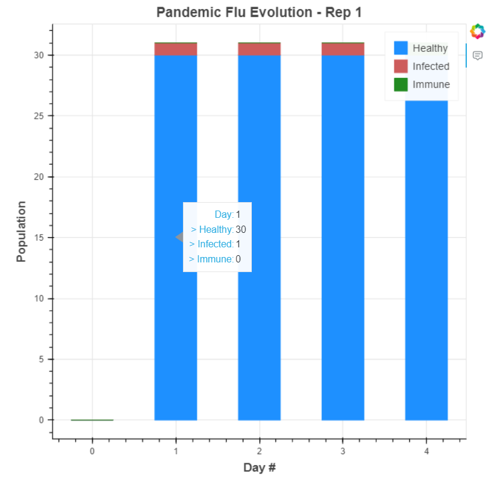
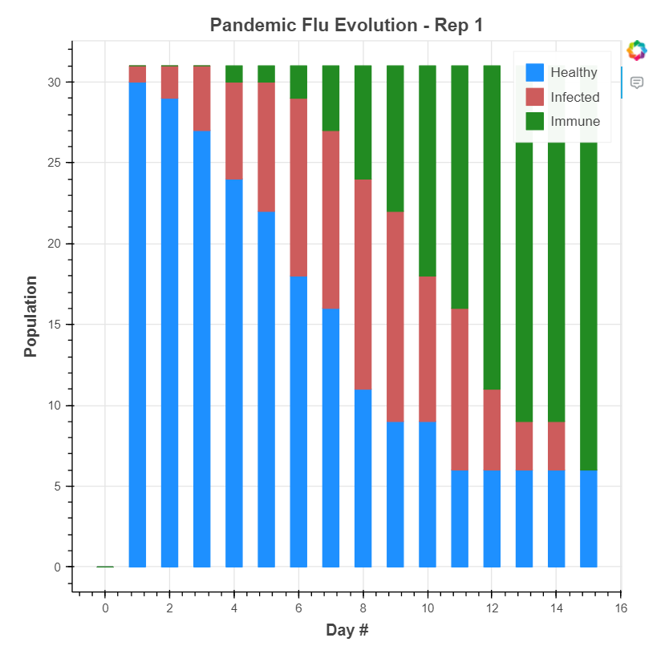
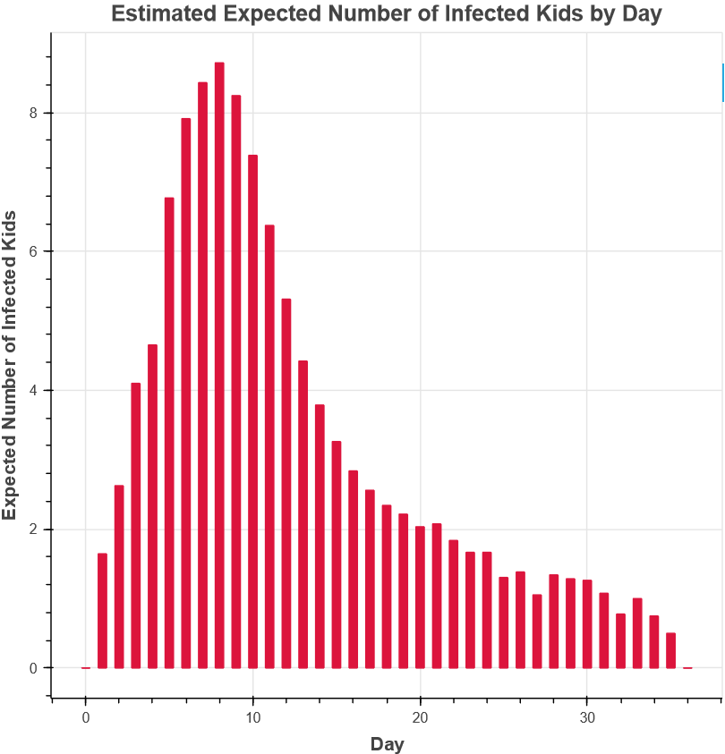
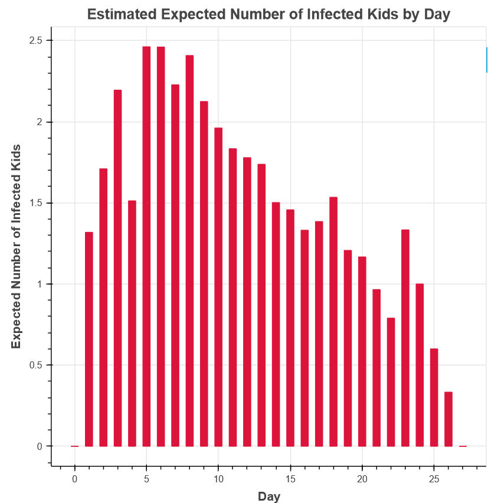

# Classroom Flu Spread Simulation
### Georgia Tech - ISYE 6644 - Simulation | Parth Patel | 04/23/2024

**Simulations are conducted to model the spread of a flu outbreak in a classroom of 31 elementary school children. One student, Tommy, initially infected with the flu, interacts with the susceptible students over a period of three days. The probability of Tommy infecting a susceptible student on any given day is assumed to be 0.02. If a student gets infected, they become infectious for the next three days. The simulation aims to analyze the dynamics of the flu spread and its impact on the student population.**

|  |  |
|:---:|:---:|
| *An example of a pandemic evolution plot where Tommy does not infect anyone and the epidemic ends in just 3 days* | *An example of a pandemic evolution plot where Tommy infects other students and the infection spreads throughout the classroom* |

**Sample graph of a simulation:**

|  |  |
|:---:|:---:|
| *Average number of kids infected by day* | *Average number of kids infected by day when the population had a 50-50 chance of being immune at the start of the simulation*

Below is a brief description of each file in this repo:

- **Classrom Flu Spread Project.ipynb**: A Jupyter Notebook with a detailed walkthrough of the project. It includes the code and explanations necessary to understand the simulation. The notebook allows for different settings of the simulation to be explored and adjusted. Final results and conclusions are not explained and can be found in the final pdf report.

- **Classrom Flu Spread Project.html**: A webpage version of the notebook but with the results and outputs already executed and displayed. It has the results from my runs that I used to write up the final report and can be useful for quickly checking values and examining plots.

- **Classrom Flu Spread Project - Final Report.pdf** - A final report with detailed findings and results. It can be useful in combination with the notebook to understand the full project.

- **sim_funcs.py**: Contains all the main functions used to run the simulations. It uses various libraries and provides the necessary logic and calculations for simulating the flu outbreak within the classroom.

- **plot_helper.py**: Contains all the plotting functions used to visualize histograms and evolution plots. It uses a combination of Bokeh and Matplotlib libraries to make visual representations of the simulation results.

- **img folder**: These images are from the final report and are used in the readme file. 

- **dst folder**: These dst files are used in the Arena input analyzer and are not important for understanding the project. 